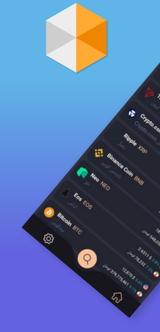
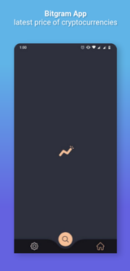
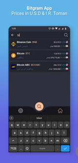
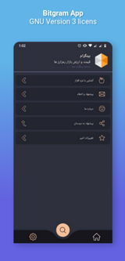

Bitgram
======

A simple android application that shows latest price of cryptocurrencies.

This project implemented in [Persian language](https://en.wikipedia.org/wiki/Persian_language) and use [KuCoin](https://www.kucoin.com/) and [Ramzinex](https://ramzinex.com/) exchange & trading websites APIs to get the latest prices.

## Features ☼
* Display the latest prices in U.S. Dollar
* Display the latest prices in I.R. Toman
* Include 60+ cryptocurrencies

## Previews ⛶







## Contribute ༜
Want to contribute? I would really appreciate a hand with the development to add more features in this app.
Feel free to Fork, edit, then pull!

## Feature roadmap ⌲

### Basics
* [x] Prices in U.S. Dollar
* [x] Prices in I.R. Toman
* [x] Persian names
* [x] Coin's icon, name in english and symbols
* [x] Searching
* [x] Bottom Navigation
* [ ] +100 coins
* [ ] Live prices

### Preferences
* [ ] Recyclerview pin feature
* [ ] Refreshing data in recyclerview 
* [ ] offline first using DataStore
* [ ] Top Gainers
* [ ] Top Losers
* [ ] News

### Features
* [ ] Connection checking
* [ ] Defi separation
* [ ] ALTS prices
* [ ] mini Chart

### Layouts
* [x] Dark theme
* [ ] Light theme
* [ ] App Widget

### Release
* [ ] Direct APK
* [ ] F-Droid
* [ ] Cafebazaar

### Components
* [x] LiveData
* [x] ViewModel
* [x] Data binding
* [x] Navigation Component
* [X] RecyclerView

### Architecture and pattern
* [x] MVVM
* [x] Repository

## Used libraries, icons ⌯
* [Coil](https://coil-kt.github.io/coil/) by [coil-kt](https://github.com/coil-kt)
* [Lottie](https://airbnb.design/lottie/) by [Airbnb](https://airbnb.io/)
* [Gson](https://github.com/google/gson) by [Google](https://opensource.google/)
* [Flaticon](https://www.flaticon.com/home) by [Freepik Company](https://www.freepikcompany.com/)

## Download ⇣
[](https://github.com/husen-hn/Bitgram/releases/latest)

## License ©
```
Copyright © 2020 Hossein HassanNejad 
Licensed under the GNU Version 3 license.
```